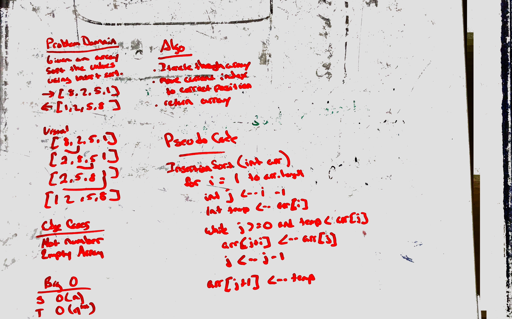

# Challenge Summary
QuickSort - Sort an array using divide and conquer algo.

## Challenge Description
Create a class lecture on quicksort sort sutiable for a 301 class.

## Approach & Efficiency
QuickSort is a Divide and Conquer algorithm.It picks an element as pivot and 
partitions the given array around the picked pivot. There are many different 
versions of quickSort that pick pivot in different ways.

Always pick first element as pivot.
Always pick last element as pivot.
Pick a random element as pivot.
Pick median as pivot.

Time: O(n^2)
Space: O(n)

## Solution
